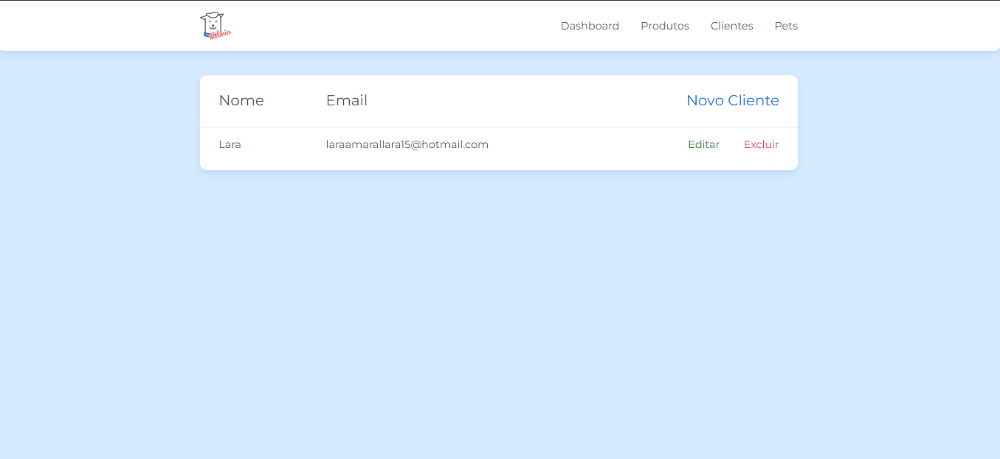

<h1 align="center"> Doguito Petshop</h1>

  Esse projeto tem como proposta criar um CRUD com JavaScript, desenvolvido durante o curso da Alura "JS na web: CRUD com JavaScript assíncrono

  

## Para rodar
- Executar no terminal na pasta admin:  json-server --watch db.json
- Executar no terminal na pasta projeto_inicial: browser-sync start --server --file . --host --port 5000 --startPath admin/telas/lista_cliente.html

## Aprendizados / Desenvolvimento

Para a comunicação com a API foi utilizado um objeto XMLHttpRequest

  - Inicializar o objeto: const http = new XMLHttpRequest()
  - Abrir a comunicação entre a aplicação e a API: http.open('GET', 'http://localhost:3000/profile')
  - Enviar a requisição: http.send()
  - Ação após fazer a requisição e enviar: 

Template para receber os dados da API
- Função "criaNovaLinha" para criar uma nova linha, nela foi utilizado document.createElement para criar a linha, e innerHTML para colocar o conteúdo que foi estruturado em HTML e tem os script nome e email.
- appendChild para colocar a linha criada dfentro do elemento pai que é o tbody
- Com os dados em um array percorremos eles para pegar cada um referente a cada um dos clientes, para isso foi utilizado o forEach para iterar sobre essa resposta. A resposta é a data, que vai conter os dados.

Promisse 
- É feita uma requisição e ele vai me devolver uma promessa de que quando aquela requisição for completa ou não, e pode fazer algo com a resposta dada.
- Inicializada com "new Promise", recebe dois parâmetros: resolve e reject, que lidam com sucesso ou erro da chamada

Fetch API
- Substitui a promise e o http
- Para utilizar a fetch basta fazer um return fetch e passar o endereço
- Fetch é um método global da interface da fetch API
- Por padrão ela faz um get e devolve uma promise